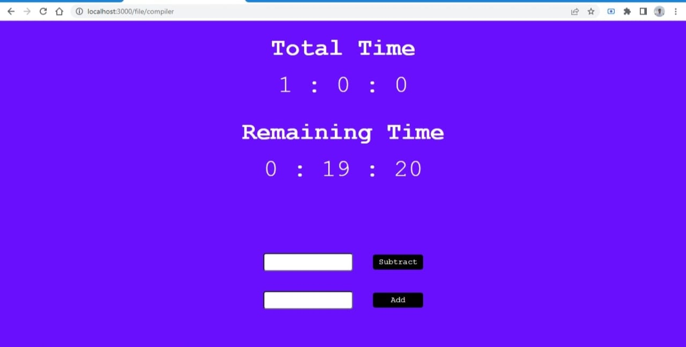

## Description
- Every course I start either from youtube or udemy they always come in the form of playlists
with every video having different time. 
- Whenever i finish few videos I get this urge to know how much more time is remaining in the playlist.
and there is usually no easy way of knowing this. so i made this project where i can create pages
for any course i watch and add a total time and keep removing the time as soon as i finish a video, this stores the data in a file and keeps updating it, this way i can keep track of how much I finished watching and how much more I need to 
watch. 

## Running the project
- you just need to clone the project and then run :
```
npm install
npm run start
```

- the client loads up in localhost:3000.
- now if you need to track a course named `ds-algo` then you just open
``` localhost:3000/file/ds-algo?totalTime=HH:MM:SS ``` add total time in the given format.
- this will create a json file in backend which will store the data for re-use whenever needed,
now you just visit the page ``` localhost:3000/file/ds-algo ``` and start adding or subtracting watch time and keeping track of how much needs to be watched.

## Screenshot of project
